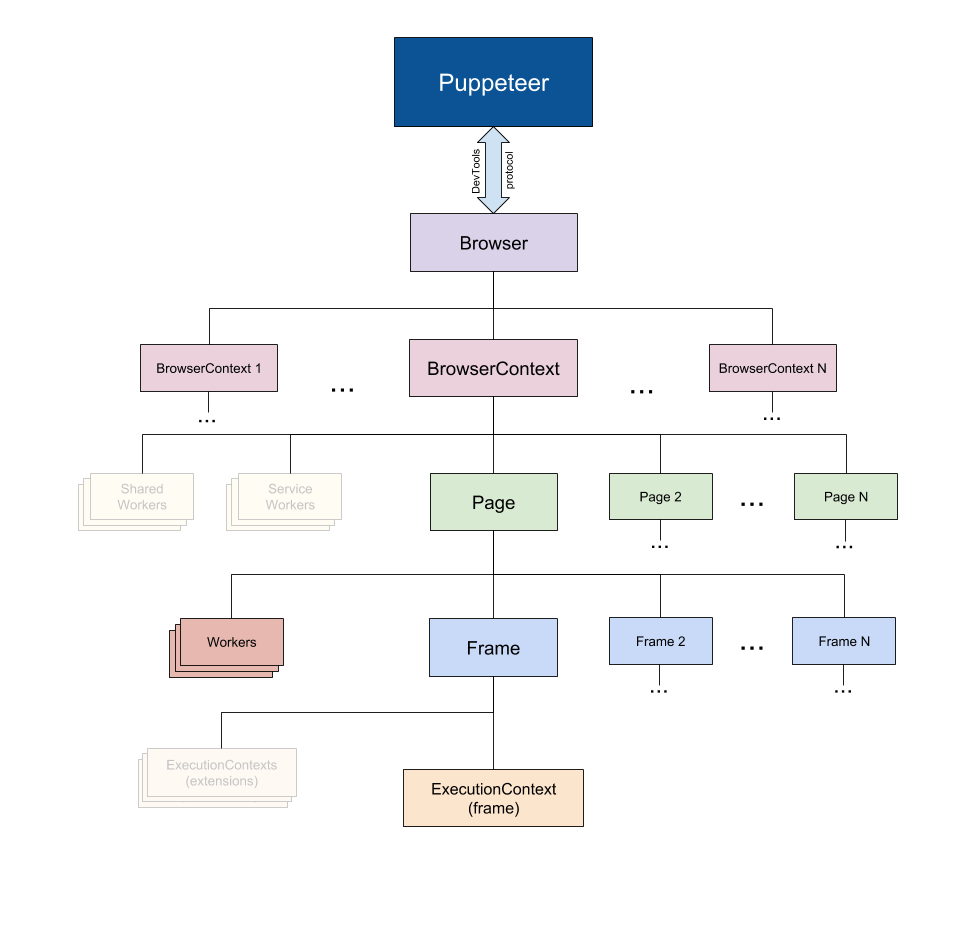
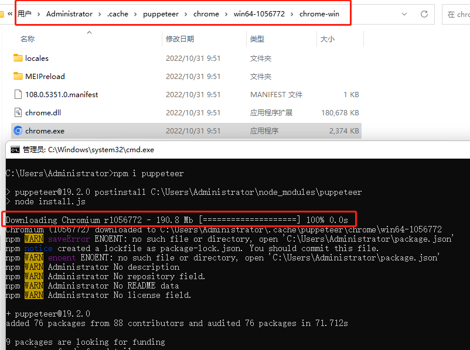
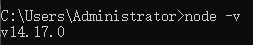

# Node puppeteer libs
## 简介
1. Puppeteer 是 Google 基于 Node.js 开发的一个工具，有了它我们可以通过 JavaScript 来控制 Chrome 浏览器的一些操作，当然也可以用作网络爬虫上，其 API 极其完善，功能非常强大。
2. Puppeteer是一个Node库，它提供了一个高级API来通过DevTools协议控制Chromium或Chrome。Puppeteer默认以headless模式运行，但是可以通过修改配置文件运行“有头”模式。  
3. 在浏览器中手动执行的绝大多数操作都可以使用Puppeteer来完成。  
4. Puppeteer API 是分层次的，反映了浏览器结构。  

Puppeteer层次结构图

- [Puppeteer]() 使用 [DevTools]() 协议 与浏览器进行通信。
- [Browser]() 实例可以拥有浏览器上下文。
- [BrowserContext]() 实例定义了一个浏览会话并可拥有多个页面。
- [Page]() 至少有一个框架：主框架。 可能还有其他框架由 [iframe]() 或 [框架标签]() 创建。
- [frame]() 至少有一个执行上下文 - 默认的执行上下文 - 框架的 JavaScript 被执行。 一个框架可能有额外的与 [扩展]() 关联的执行上下文。
- [Worker]() 具有单一执行上下文，并且便于与 [WebWorkers]() 进行交互。

## 功能
1. 生成页面 PDF。
2. 抓取 SPA（单页应用）并生成预渲染内容（即“SSR”（服务器端渲染））。
3. 自动提交表单，进行 UI 测试，键盘输入等。
4. 创建一个时时更新的自动化测试环境。 使用最新的 JavaScript 和浏览器功能直接在最新版本的Chrome中执行测试。
5. 捕获网站的 timeline trace，用来帮助分析性能问题。
6. 测试浏览器扩展。

## 安装使用
### 安装
> 方式1：npm i puppeteer  
当安装Puppeteer时，会下载最新版本的Chromium，以保证可以使用API。 如果想要跳过下载，参考环境变量设置。_PUPPETEER_SKIP_CHROMIUM_DOWNLOAD_ - 请勿在安装步骤中下载绑定的 Chromium。 [环境变量](https://github.com/puppeteer/puppeteer/blob/v1.10.0/docs/api.md#environment-variables)  

 
> 方式2：npm i puppeteer-core  
自1.7.0版本以来，都会发布一个puppeteer-core包，这个包默认不会下载 Chromium。  

### [puppeteer](https://www.npmjs.com/package/puppeteer)与[puppeteer-core](https://www.npmjs.com/package/puppeteer-core)的区别  
> puppeteer 是浏览器自动化的 产品。安装后，它会下载一个版本的 Chromium，然后使用puppeteer-core 驱动工作。作为最终用户产品，puppeteer 支持一堆方便的 PUPPETEER_* env 变量来调整行为。  
> puppeteer-core 是一个 _库_ 来帮助驱动任何支持 DevTools协议的东西。puppeteer-core在安装时```不会下载Chromium```。作为一个库，puppeteer-core 是完全是通过其编程接口驱动的并```忽略所有PUPPETEER_* env 变量```。  

#### 下面这些情况需要使用 puppeteer-core:
1. 正在构建 DevTools 协议顶部的另一个最终用户产品或库。例如，可以使用puppeteer-core 构建PDF生成器并编写下载[headless_shell](https://chromium.googlesource.com/chromium/src/+/lkgr/headless/README.md)的自定义install.js脚本而不是Chromium来节省磁盘空间。  
2. 正在打包 Puppeteer 用在 Chrome 扩展应用或浏览器中以使用 DevTools 协议，因为下载额外的 Chromium 二进制文件不是必须的。


### 使用
Puppeteer至少需要Node v6.4.0，使用async/await，它们仅在Node v7.6.0或更高版本中被支持。Puppeteer使用起来和其他测试框架类似。需要创建一个Browser实例，打开页面，然后使用Puppeteer的API。  


> * 使用puppeteer  
> const puppeteer = require('puppeteer');  
> * 使用puppeteer-core  
> const puppeteer = require('puppeteer-core'); 


#### 示例demo1：跳转到https://example.com 并保存截图至 demo1.png  
> node demo1.js  


#### 示例demo2：将指定页面创建成一个PDF
> node demo2.js  
>> Puppeteer 初始化的屏幕大小默认为 800px x 600px。但是这个尺寸可以通过[Page.setViewport()](https://github.com/puppeteer/puppeteer/blob/v1.10.0/docs/api.md#pagesetviewportviewport) 设置。  

[查看PDF操作API](https://github.com/puppeteer/puppeteer/blob/v1.10.0/docs/api.md#pagepdfoptions)

#### 示例demo3：在页面中执行脚本
> node demo3.js  
>> 查看[Page.evaluate()](https://github.com/puppeteer/puppeteer/blob/v1.10.0/docs/api.md#pageevaluatepagefunction-args)操作API，该方法有点类似于 ```evaluateOnNewDocument``` and ```exposeFunction```。

## 默认设置
1. 使用无头模式  
Puppeteer 运行 Chromium 的headless mode。如果想要使用完全版本的 Chromium，设置 'headless' option 即可。
const browser = await puppeteer.launch({headless: false}); // default is true
2. 运行绑定的 Chromium 版本  
默认情况下，Puppeteer 下载并使用特定版本的 Chromium 以及其 API 保证开箱即用。 如果要将 Puppeteer 与不同版本的 Chrome 或 Chromium 一起使用，在创建Browser实例时传入 Chromium 可执行文件的路径即可：
const browser = await puppeteer.launch({executablePath: '/path/to/Chrome'});
3. 创建用户配置文件  
Puppeteer 会创建自己的 Chromium 用户配置文件，它会在每次运行时清理。


## 环境变量
Puppeteer寻找某些环境变量来帮助其操作。 如果puppeteer在环境中没有找到它们，这些变量的小写变体将从[npm 配置](https://docs.npmjs.com/cli/v8/commands/npm-config)中使用。

## Error handling
如果 Puppeteer 方法无法执行一个请求，就会抛出一个错误。例如，page.waitForSelector(selector[, options]) 选择器如果在给定的时间范围内无法匹配节点，就会失败。  
对于某些类型的错误，Puppeteer 使用特定的错误类处理。这些类可以通过 require('puppeteer/Errors') 获得。


## 参考资料  
1. [Puppeteer 中文文档](https://puppeteer.bootcss.com/)  
1. [代码仓库](https://github.com/puppeteer/puppeteer.git)  
1. [API](https://github.com/puppeteer/puppeteer/blob/v1.10.0/docs/api.md)
1. [API 中文文档](https://zhaoqize.github.io/puppeteer-api-zh_CN/#/)
1. [Some Examples](https://github.com/puppeteer/puppeteer/tree/main/examples)
1. [Community list of Puppeteer resources](https://github.com/transitive-bullshit/awesome-puppeteer)