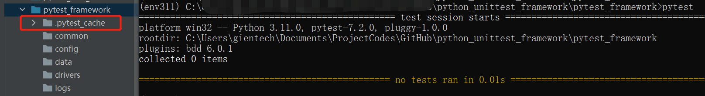

#Python pytest framework

## 介绍
适用于多种软件测试的Pytest，是另一个Python类型的自动化测试框架。凭借着其开源和易学的特点，该工具经常被QA(质量分析)团队、开发团队、个人团队、以及各种开源项目所使用。鉴于Pytest具有“断言重写(assert rewriting)”之类的实用功能，许多大型互联网应用，如Dropbox和Mozilla，都已经从下面将要提到的unittest(Pyunit)切换到了Pytest之上。  
pytest是python的一种单元测试框架，与python自带的unittest测试框架类似，但是比unittest框架使用起来更简洁，效率更高。  
Python第三方单元测试库，通用性更广。  

参见
> [官方文档](https://pytest.org/en/latest/)  
> [Pytest使用手册](https://learning-pytest.readthedocs.io/zh/latest/)

## 特点
```
① 非常容易上手，入门简单，文档丰富，文档中有很多实例可以参考。
② 能够支持简单的单元测试和复杂的功能测试。
③ 支持参数化。
④ 执行测试过程中可以将某些测试跳过，或者对某些预期失败的case标记成失败。
⑤ 支持重复执行失败的case。
⑥ 支持运行由nose, unittest编写的测试case。
⑦ 具有很多第三方插件，并且可以自定义扩展。
⑧ 方便的和持续集成工具集成。
⑨ 它提供了测试用例的详细失败信息，使得开发者可以快速准确地改正问题。
⑩ 它兼容最新版本的Python。
```

## 安装
pip install pytest  
运行查看pytest版本


## 目录
* common 公共函数  
  公共函数、方法以及通用操作的管理。
* config 配置文件目录  
  存放所有使用的配置文件，实现配置与代码分离。
* data 测试数据目录  
  将所有的用例参数化使用的文件放到这里，一般可采用xlsx、csv、xml等格式。实现数据与代码分离。
* drivers 驱动目录  
  一般存放浏览器驱动，如如Chromedriver等。
* logs 日志目录  
  存放运行时日志和错误日志error log等。
* report 测试报告  
  管理和存放程序运行后生成的测试报告，一般可有html报告、excel报告等。
* testcase 测试用例  
  测试用例管理功能，可以分模块编写，建相应的目录。


## 使用方法
pytest 运行所有当前目录中test_*.py or *_test.py 的文件中以test_开头的函数  
以"quiet"模式运行测试方法：pytest -p test_function.py

pytest中用例设计原则
> 1. 文件名以test_开头或者以_test结尾。  
> 1. 以test开头的函数。  
> 1. 以Test开头的类。  
> 1. 以test_开头的方法。  
> 1. 所有的包package必须要有__init__.py文件。  
